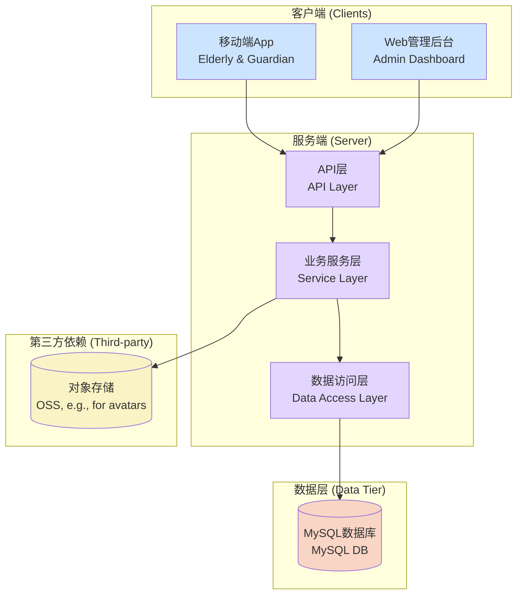
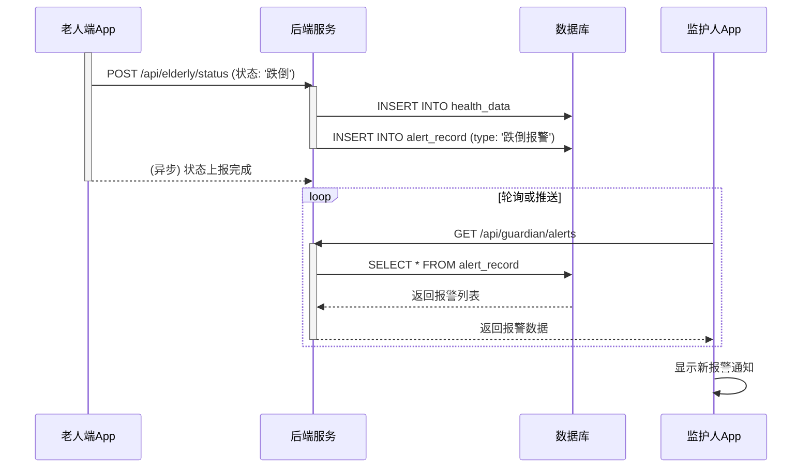

# 智慧养老监护系统架构分析报告

> **版本**: 1.0
> **日期**: 2026-03-06
> **分析师**: Gemini Code Assistant

## 1. 系统结构梳理 (System Structure)

本系统是一个典型的单体仓库(Monorepo)项目，包含移动端App、Web管理后台和后端服务三大部分。

### 1.1. 逻辑架构图 (Logical Architecture)

#### App端 (Mobile Apps)

```mermaid
graph TD
    subgraph ElderlyApp (老人端)
        direction LR
        E_UI[页面层<br>Pages] --> E_SVC[服务层<br>Services]
    end

    subgraph GuardianApp (监护人端)
        direction LR
        G_UI[页面层<br>Pages] --> G_SVC[服务层<br>Services]
    end

    E_SVC -->|HTTP/HTTPS| API_GW
    G_SVC -->|HTTP/HTTPS| API_GW[后端API服务<br>Backend API]

    style E_UI fill:#cde4ff
    style G_UI fill:#cde4ff
    style E_SVC fill:#e2d6ff
    style G_SVC fill:#e2d6ff
```

#### Web端与整体架构 (Web & Overall Architecture)



### 1.2. 技术栈 (Technology Stack)

| 层次 | 组件 | 技术/框架 | 版本号 | 备注 |
| :--- | :--- | :--- | :--- | :--- |
| **后端** | **Server** | **Node.js** | - | JavaScript 运行时 |
| | 核心框架 | Express.js | `^4.18.2` | Web服务框架 |
| | ORM | Sequelize | `^6.35.1` | 对象关系映射 |
| | DB驱动 | mysql2 | `^3.6.5` | 连接MySQL数据库 |
| | 其他 | cors, dotenv | `^2.8.5`, `^16.3.1` | |
| **Web端** | **Admin** | **React** | `^19.2.4` | 前端UI框架 |
| | 语言 | TypeScript | `~5.8.2` | |
| | 构建工具 | Vite | `^6.2.0` | |
| | 路由 | React Router | `^7.13.0` | |
| | HTTP客户端 | Axios | `^1.13.5` | |
| | UI库 | Recharts, Lucide-react | `^3.7.0`, `^0.563.0` | 图表与图标 |
| **移动端** | **Apps** | **HarmonyOS** | - | 华为鸿蒙操作系统 |
| | 语言 | ArkTS | - | 鸿蒙应用开发语言 |
| | 测试 | @ohos/hypium, @ohos/hamock | `1.0.25`, `1.0.0` | |

### 1.3. 核心模块及其职责 (Core Modules & Responsibilities)

#### 后端服务 (Server)
- **认证模块 (Auth)**: 处理老人和监护人登录，当前为模拟实现。
- **老人业务模块 (Elderly)**: 供老人端App调用，负责上报状态/位置、管理监护人关系、发起SOS等。
- **监护人业务模块 (Guardian)**: 供监护人App和Web后台调用，负责获取老人列表、详情、报警记录等。
- **统计与历史模块 (Stats)**: 提供历史活动数据查询。
- **数据持久化层**: 使用Sequelize和原生SQL与MySQL数据库交互。

#### Web管理后台 (Web)
- **页面模块 (Pages)**: 对应各项管理功能，如仪表盘、用户管理、报警中心、地图追踪等。
- **服务模块 (Services)**: 封装对后端API的HTTP请求。
- **通用组件 (Components)**: 可复用的UI元素。

#### 移动端 (Apps)
- **ElderlyApp (老人端)**: 核心功能为SOS、状态上报、亲情号码管理。
- **GuardianApp (监护人端)**: 核心功能为实时查看老人状态、接收警报、查询历史轨迹。

#### 模块间调用关系
- **数据流**: 所有客户端 (App/Web) -> 后端API服务 -> 数据库。
- **调用链**: 客户端UI -> 客户端服务层 (HTTP请求) -> 后端路由 -> 后端业务逻辑 -> 数据库。

```

## 2. 端口与服务清单 (Ports & Services)

| 服务 | 端口 | 协议 | 进程/容器 | 鉴权方式 | CORS策略 | 备注 |
| :--- | :--- | :--- | :--- | :--- | :--- | :--- |
| 后端API服务 | `3000/TCP` | HTTP | `node server.js` | Header `Authorization` (模拟) | `*` (允许所有) | 生产环境需收紧CORS |
| Web开发服务 | `3000/TCP` | HTTP | `vite` | 无 | N/A | 与后端服务存在端口冲突 |

### 2.1. 端口冲突与防火墙规则 (Port Conflicts & Firewall)

- **端口冲突**: 后端服务和Web开发服务器默认配置**均使用3000端口**，无法同时启动。**必须**在开发或部署时错开端口。
- **防火墙**: 部署时，需在服务器安全组或防火墙中开放服务所需端口（如3000），并根据安全需要限制访问源IP。

## 3. 功能矩阵与业务链路 (Features & Business Flow)

### 3.1. 功能点清单 (Feature List)

#### 用户端功能 (App)

| 功能点 (老人/监护人) | 入口地址 (App页面) | 依赖接口 (后端API) |
| :--- | :--- | :--- |
| 用户登录 | `LoginPage.ets` | `POST /api/auth/login/elderly`, `POST /api/auth/login/guardian` |
| 查看个人信息 (老人) | `ProfilePage.ets` | `GET /api/elderly/profile` |
| 管理监护人 (老人) | `ProfilePage.ets` | `GET /api/elderly/guardians`, `POST /api/elderly/bind`, `POST /api/elderly/unbind` |
| 紧急呼叫SOS (老人) | `HomePage.ets` | `POST /api/elderly/sos` |
| 查看被监护人列表 (监护人) | `HomePage.ets` | `GET /api/guardian/elderly` |
| 查看报警记录 (监护人) | `AlertPage.ets` | `GET /api/guardian/alerts` |
| 查看历史活动 (通用) | `HistoryPage.ets` | `GET /api/stats/history/:elderlyId` |

#### 管理端功能 (Web)

| 功能点 | 入口地址 (Web页面) | 依赖接口 (后端API) | 状态 |
| :--- | :--- | :--- | :--- |
| 仪表盘 | `/` (`Dashboard.tsx`) | `GET /guardian/elderly` | 已实现 |
| 报警中心 | `/alert-center` (`AlertCenter.tsx`) | `GET /api/guardian/alerts` | 已实现 |
| 历史记录 | `/history` (`History.tsx`) | `GET /api/stats/history/:elderlyId` | 已实现 |
| 地图追踪 | `/map-tracking` (`MapTracking.tsx`) | `GET /guardian/elderly` | 部分实现 |
| 老人/监护人管理 | `/elderly-management` | (增删改查API缺失) | **未实现** |
| 健康报告/数据分析 | `/health-report` | (相关API缺失) | **未实现** |
| 设备管理 | `/device-management` | (相关API缺失) | **未实现** |

#### 后台任务

| 任务名称 | 触发方式 | 核心逻辑 | 备注 |
| :--- | :--- | :--- | :--- |
| 老人端状态上报 | App定时/事件触发 | 调用 `POST /api/elderly/status` 和 `POST /api/elderly/location` | App核心后台逻辑 |
| 跌倒/SOS自动报警 | Server端事件触发 | 接收到特定请求后，在 `alert_record` 表插入记录 | Server端业务联动 |

### 3.2. 核心业务流程 (Core Business Flow)

#### 业务流程1: 老人跌倒自动检测与报警 (Fall Detection & Alert)



### 3.3. 缓存与降级策略 (Caching & Fallback)

- **缓存策略**: 经静态代码分析，当前系统**未发现任何缓存机制** (如 Redis, Memcached)。所有数据请求均直接访问数据库。
- **降级方案**: 当前系统**未发现任何服务降级、熔断或限流机制**。

```

## 4. 性能与可靠性评估 (Performance & Reliability)

**说明: 此部分信息无法通过静态代码分析获得，需要在运行时环境中，借助监控和压测工具来采集。**

- **性能指标 (QPS, P99延迟, 错误率)**: 
  - **获取建议**: 需在生产或预发环境中，通过APM工具（如Prometheus + Grafana, SkyWalking, Datadog）配置监控和告警，持续收集数据。
- **限流、熔断、灰度策略**: 
  - **现状**: 代码中未发现相关实现。
  - **获取建议**: 确认是否在API网关层（如Nginx, Kong）或服务网格（如Istio）中配置了相关策略。
- **压力测试与瓶颈**: 
  - **获取建议**: 使用压测工具（如JMeter, k6, nGrinder）针对核心API（特别是高频读写接口）进行压力测试，结合服务器资源监控（CPU, 内存, IO）来定位瓶颈点。

## 5. 安全与合规检查 (Security & Compliance)

**说明: 此部分信息依赖专用的安全扫描工具和对部署环境的检查。**

- **漏洞扫描**: 
  - **硬编码密钥**: 在`web/vite.config.ts`中发现`process.env.GEMINI_API_KEY`的使用，需确认该密钥的加载方式是否安全，避免硬编码在最终产物中。
  - **获取建议**: 
    - **依赖漏洞**: 使用`npm audit`或Snyk、Trivy等工具扫描`package.json`，检查是否存在已知的CVE漏洞。
    - **OWASP Top10**: 使用SAST（静态应用安全测试）和DAST（动态应用安全测试）工具进行全面扫描。
- **HTTPS与数据加密**: 
  - **获取建议**: 
    - **证书配置**: 检查Web服务器（如Nginx）或负载均衡器（如ALB）的配置，确认HTTPS证书的有效期、HSTS、CSP等安全头的设置。
    - **数据加密**: 审阅代码中处理敏感数据（如密码、个人信息）的逻辑，确认是否在传输和存储时使用了恰当的加密算法（如AES, RSA）和密钥管理方案。

## 6. 部署与运维信息 (Deployment & DevOps)

**说明: 此部分信息分散在CI/CD平台和配置文件中。**

- **交付物**: 
  - **现状**: 项目中未发现`Dockerfile`, `docker-compose.yml`或Kubernetes YAML文件。
  - **获取建议**: 检查项目的CI/CD流水线配置（如Jenkinsfile, GitHub Actions workflow），以了解构建和部署流程。
- **配置管理**: 
  - **现状**: 使用`.env`文件进行配置管理。
  - **获取建议**: 确认生产环境中是否使用集中的配置中心（如Nacos, Apollo, Consul）或云厂商的Secret Manager来管理敏感配置。
- **日志与回滚**: 
  - **获取建议**: 检查日志收集系统（如ELK, Loki）的配置，了解日志格式、采样率和保留周期。检查CI/CD平台的部署历史，了解版本回滚策略和数据库迁移脚本（如`1.sql`, `init.sql`）的版本控制方式。

## 7. 交付物与质量门槛 (Deliverables & Quality)

- **报告格式**: 本报告为Markdown格式。架构图使用Mermaid.js语法绘制。
- **缺失产出**: 
  - **Excel功能矩阵**: 需要根据本报告中的功能清单，手动创建Excel表格。
  - **Confluence页面**: 需要手动在Confluence上创建页面并索引此报告。
- **质量门槛**: 本报告基于静态代码分析完成，覆盖了大部分结构性和逻辑性的审查点。但一份达到90分以上的完整报告，**必须补充**上述4, 5, 6节中需要动态获取和外部检查的信息。

```
```